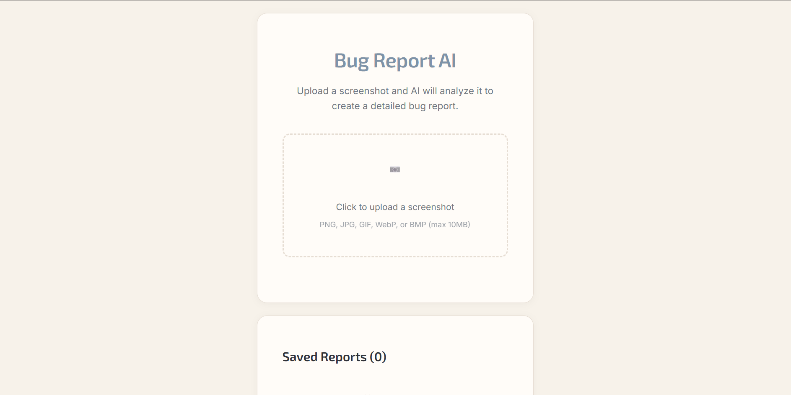
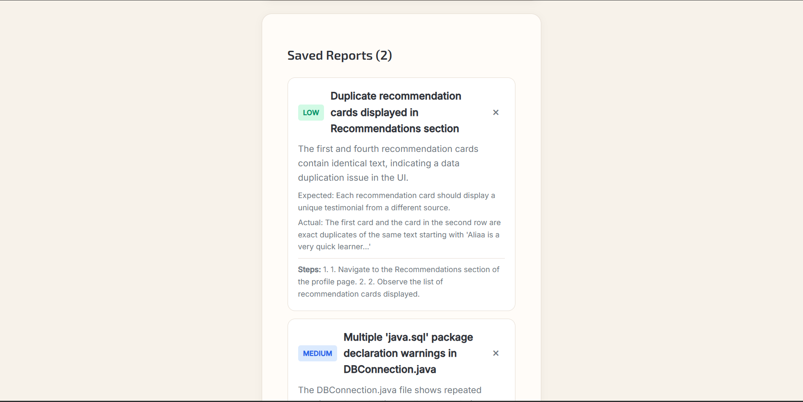
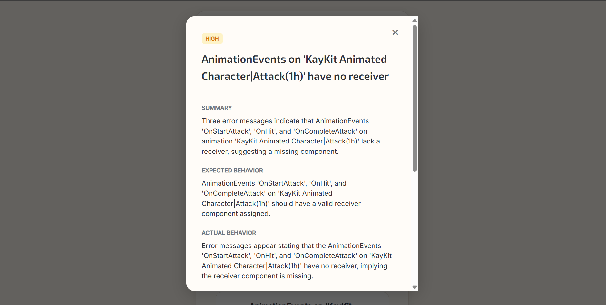

#  Bug Report AI

> Turn a screenshot into a structured bug report — instantly.


Bug Report AI is a full-stack web app that turns a screenshot into a structured bug report. Upload a screenshot, let the AI analyze it, and get a complete draft report — ready to review, edit, save, and manage.

---

## ✨ Features

-  **Upload** a screenshot from the homepage
-  **AI-powered** screenshot analysis
-  **Auto-generated** bug report preview
-  **Edit** the generated report before saving
-  **Save reports** to a SQLite database
-  **View** saved reports in a clean modal
-  **Preview** the uploaded screenshot inside the saved report modal
-  **Delete** reports with a custom in-app confirmation modal
-  **Friendly validation** and error handling throughout

---

## Screenshots

### Homepage


### Saved Reports


### Report Modal


---

## 🛠️ Tech Stack

| Layer | Technology |
|---|---|
| **Frontend** | React, Vite, Plain CSS |
| **Backend** | FastAPI, SQLAlchemy, Alembic |
| **Database** | SQLite |
| **AI** | OpenRouter (OpenAI-compatible client) |

---

## 🚀 How It Works

```
User uploads screenshot
        ↓
Backend saves the image
        ↓
AI analyzes the screenshot
        ↓
Frontend shows generated bug report preview
        ↓
User saves / edits / starts over
        ↓
Saved reports live in the reports list
```

---

## 🗺️ User Flow

1. Upload a screenshot
2. AI analyzes it automatically
3. A read-only generated preview appears
4. Choose what to do next:
   - **Save Report** — persist it directly
   - **Edit** — tweak before saving
   - **Start Over** — upload a new screenshot
5. Open any saved report in a modal with full details + screenshot preview
6. Delete reports through a custom confirmation modal

---

## 📁 Project Structure

```text
bug-report-generator/
├── backend/
│   ├── app/
│   │   ├── api/
│   │   ├── core/
│   │   ├── db/
│   │   ├── repositories/
│   │   ├── schemas/
│   │   ├── services/
│   │   └── main.py
│   ├── alembic/
│   ├── uploads/
│   ├── requirements.txt
│   └── .env
├── frontend/
│   ├── src/
│   │   ├── pages/
│   │   ├── shared/
│   │   ├── App.jsx
│   │   └── main.jsx
│   ├── package.json
│   └── vite.config.js
└── README.md
```

### Backend responsibilities
- Image upload handling
- AI screenshot analysis
- Report creation and retrieval
- Report deletion
- Serving uploaded screenshots as static files

### Frontend responsibilities
- Upload UI
- Generated preview UI
- Edit form
- Saved reports list
- Report details modal
- Delete confirmation modal
- Error and validation feedback

---

## ⚙️ Environment Variables

Create a `backend/.env` file:

```env
APP_NAME=Bug Report AI
APP_ENV=development
API_PREFIX=/api

DATABASE_URL=sqlite:///./bug_report.db

OPENROUTER_API_KEY=your_openrouter_key_here
OPENROUTER_BASE_URL=https://openrouter.ai/api/v1
OPENROUTER_MODEL=openrouter/free
```

---

## 📦 Installation

### 1. Backend setup

```bash
cd backend
pip install -r requirements.txt
```

### 2. Frontend setup

```bash
cd frontend
npm install
```

---

## ▶️ Run the App

### Start the backend

```bash
cd backend
uvicorn app.main:app --reload
```

> Runs on **http://127.0.0.1:8000**

### Start the frontend

```bash
cd frontend
npm run dev
```

> Runs on **http://127.0.0.1:5173**

---

## 🗄️ Database

SQLite is used for simplicity. Reports are stored with the following fields:

| Field | Description |
|---|---|
| `title` | Report title |
| `summary` | Short description of the bug |
| `severity` | Bug severity level |
| `reproduction_steps` | Steps to reproduce |
| `expected_behavior` | What should happen |
| `actual_behavior` | What actually happens |
| `page_url` | URL where the bug occurred |
| `user_note` | Optional user note |
| `image_path` | Path to the uploaded screenshot |
| `suspected_area` | Area of the app suspected |
| `confidence` | AI confidence level |
| `created` | Timestamp |

Alembic is included for migrations.

---

## 🔌 API Overview

| Method | Endpoint | Description |
|---|---|---|
| `POST` | `/api/upload` | Upload an image file, returns saved file path |
| `POST` | `/api/analyze` | Send image to AI, returns generated report fields |
| `POST` | `/api/reports` | Save a bug report to the database |
| `GET` | `/api/reports` | Return all saved reports |
| `GET` | `/api/reports/{report_id}` | Return a single report |
| `DELETE` | `/api/reports/{report_id}` | Delete a report |
| `GET` | `/api/health` | Backend health check |

---

## 🛡️ Validation & Error Handling

The app handles the following edge cases:

- ❌ Invalid file type
- ❌ Empty file upload
- ❌ Oversized file upload
- ❌ AI analysis failure
- ❌ Save failure
- ❌ Delete failure
- ❌ Missing screenshot preview
- ❌ Empty saved reports state

> If AI analysis fails, the user can still continue and fill the report manually.

---

## 🎬 Demo Flow

```
1. Start backend and frontend
2. Open the frontend in your browser
3. Upload a screenshot
4. Wait for AI analysis
5. Review the generated preview
6. Edit if needed
7. Save the report
8. Open the saved report modal
9. Confirm screenshot preview works
10. Delete the report using the custom confirmation modal
```

---

## 💡 Why This Project

This project demonstrates:

- Full-stack development with FastAPI + React
- AI integration into a real product workflow
- Modular, layered architecture
- File upload handling
- Database persistence with SQLAlchemy + Alembic
- Clean UI/UX iteration
- Validation and edge-case handling

---

## 🔮 Future Improvements

- [ ] Edit already-saved reports
- [ ] Search and filter reports
- [ ] Authentication
- [ ] Export bug reports (PDF, Markdown, Jira)
- [ ] Richer AI prompts
- [ ] Multiple screenshot support
- [ ] Deployment
- [ ] Automated tests

---

## ✅ Current Status

| Feature | Status |
|---|---|
| Upload | ✅ Working |
| AI analysis | ✅ Working |
| Generated preview | ✅ Working |
| Editing | ✅ Working |
| Saving | ✅ Working |
| Viewing saved reports | ✅ Working |
| Screenshot preview | ✅ Working |
| Delete flow | ✅ Working |

---

## 👤 Author

Built as a software engineering project to explore AI integration in a practical product workflow.
